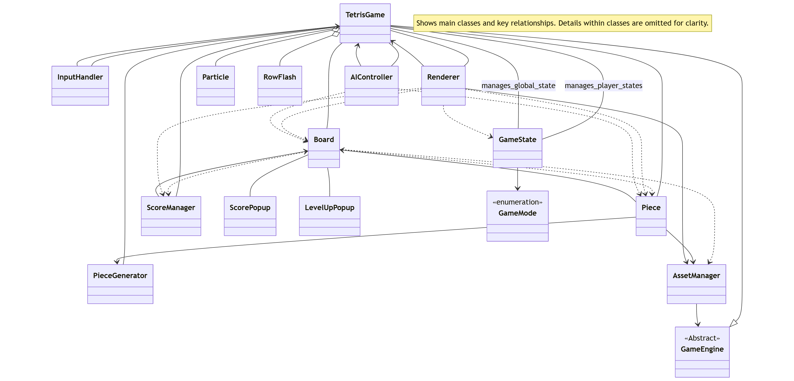

# 🎮 Tetris Game (Java OOP Edition)

Welcome to the Tetris Game project built using Java and object-oriented programming principles. This project demonstrates a modular design of a classic puzzle game using clean architecture, game loop logic, and custom rendering.

## ✨ Features

*   **Multiple Game Modes:**
    *   **1 Player:** Classic single-player Tetris.
    *   **2 Players:** Competitive mode for two human players on the same screen.
    *   **Player vs AI:** Play against a basic AI opponent.
*   **Classic Tetris Mechanics:**
    *   Falling Tetrominoes of various shapes.
    *   Piece rotation (clockwise and counter-clockwise).
    *   Piece movement (left, right, soft drop).
    *   Hard drop.
    *   Hold piece functionality.
*   **Visuals & UI:**
    *   Next piece preview (multiple pieces).
    *   Ghost piece (shows where the current piece will land).
    *   Score and level display.
    *   In-game help screen.
    *   Pause menu with options to resume, get help, or quit to the main menu.
*   **Scoring & Progression:**
    *   Points awarded for line clears (Single, Double, Triple, Tetris).
    *   Increasing levels with faster fall speeds.
    *   Garbage lines sent to opponents in 2-player modes.
*   **Audio:**
    *   Background music tracks (selectable).
    *   Sound effects for various game actions (piece lock, line clear, game over, etc.).
*   **Special Effects:**
    *   Particle effects for line clears.
    *   Row flash animation for cleared lines.

## ⌨️ Controls

**Player 1 (Left Side / Single Player):**
*   **Move Left/Right:** Left/Right Arrow Keys
*   **Soft Drop:** Down Arrow Key
*   **Rotate Clockwise:** Up Arrow Key
*   **Rotate Counter-Clockwise:** Z
*   **Hard Drop:** Space Bar
*   **Hold Piece:** C

**Player 2 (Right Side - in 2 Player or Player vs AI mode):**
*   **Move Left/Right:** A / D
*   **Soft Drop:** S
*   **Rotate Clockwise:** W
*   **Rotate Counter-Clockwise:** Q
*   **Hard Drop:** Left Shift / Right Shift
*   **Hold Piece:** E

**Global Controls:**
*   **Pause Game / Resume (from P-pause):** P
*   **Open Pause Menu / Resume (from Esc-pause):** Esc
*   **Navigate Menus:** Up/Down Arrow Keys
*   **Select Menu Option:** Enter
*   **Return to Main Menu (from Pause/Game Over):** R
*   **Open Help Screen:** H (during gameplay or from Esc Pause Menu)
*   **Music Control (during gameplay):**
    *   `1`: Track 1
    *   `2`: Track 2
    *   `3`: Track 3
    *   `0`: Stop Music
*   **Quit Game (from Main Menu):** Select "Quit" option.

## 🚀 How to Run

1.  **Prerequisites:**
    *   Java Development Kit (JDK) installed (e.g., JDK 11 or newer).
2.  **Compile:**
    Open a terminal or command prompt in the project's root directory (where the `src` folder is).
    ```bash
    javac -d bin -cp src src/*.java
    ```
    *If your classes are in packages within `src`, adjust the `javac` command accordingly (e.g., `javac -d bin src/yourpackage/*.java`).*
3.  **Run:**
    After successful compilation, run the main class:
    ```bash
    java -cp bin TetrisGame
    ```
    *If your `TetrisGame.java` class is in a package, prefix it with the package name (e.g., `java -cp bin yourpackage.TetrisGame`).*

## 🗂️ Code Structure

| Class             | Description                                                                                                |
|-------------------|------------------------------------------------------------------------------------------------------------|
| `TetrisGame`      | Main game controller: manages game modes (1P, 2P, PvAI), game loop, player states, input, and rendering orchestration. |
| `Board`           | Represents the Tetris grid for each player. Handles piece locking, line clearing, garbage, and collision detection. |
| `Piece`           | Represents a Tetromino. Manages its shape, rotation, movement, and interaction with the board.                |
| `PieceGenerator`  | Generates the sequence of Tetris pieces for players, ensuring variety.                                     |
| `ScoreManager`    | Tracks and calculates player scores, levels, and handles scoring events like line clears.                  |
| `GameState`       | Manages individual player status (e.g., game over, countdown) and global game status (e.g., menu, pause options, help screen). |
| `InputHandler`    | Processes keyboard inputs from players for piece control and game actions.                                 |
| `AIController`    | Provides basic AI logic for controlling a Tetris piece in "Player vs AI" mode.                             |
| `Renderer`        | Responsible for drawing all visual elements of the game, including boards, pieces, UI, and special effects. |
| `AssetManager`    | Loads and manages game assets like images (tiles, backgrounds, logo) and sounds (music, sound effects).     |

## 🖼️ Game Snapshots

Below are some gameplay screenshots showing different game states:

### ▶️ Game Start


### 👻 Ghost Piece


### 🧱 Help Screen


### 💥 Pause Menu


## 🧩 Class Diagram



*This UML diagram illustrates the main architecture of the Tetris game and how different components interact with each other.*
